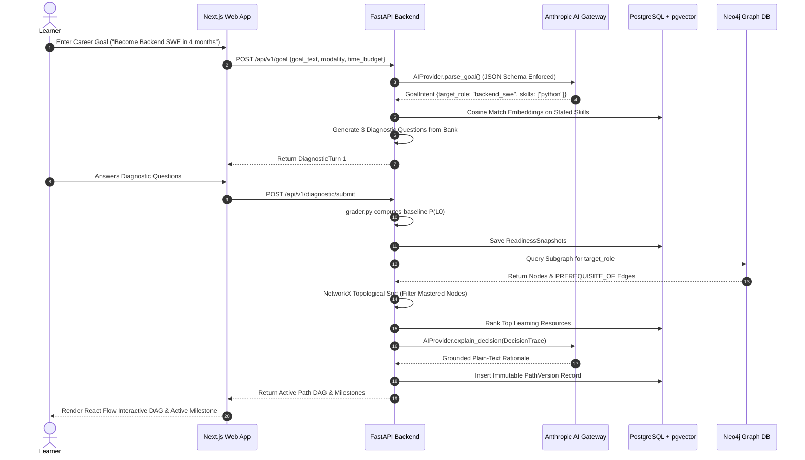
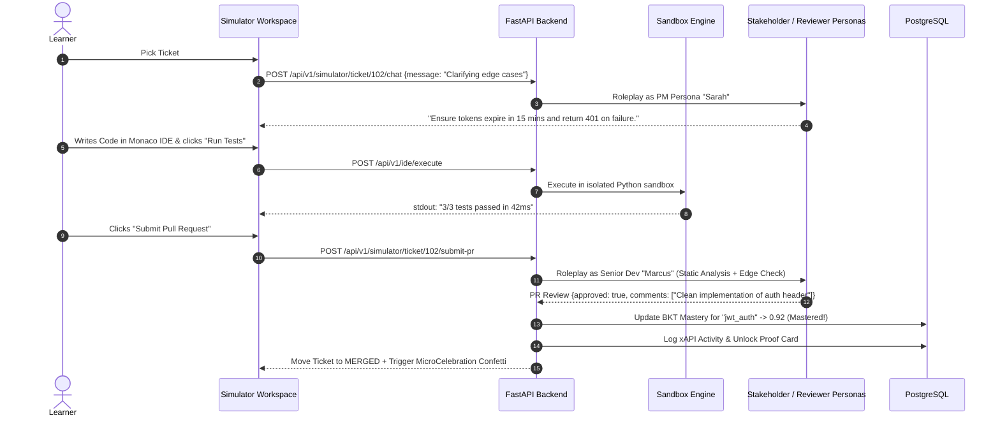
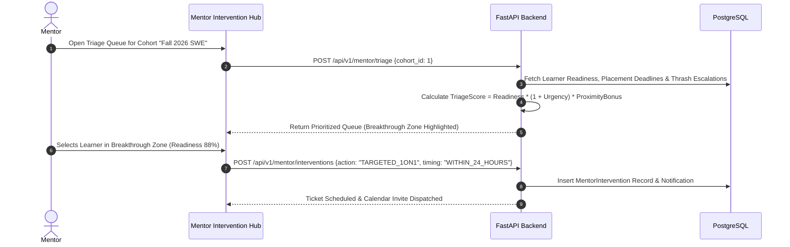
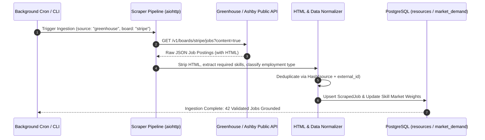
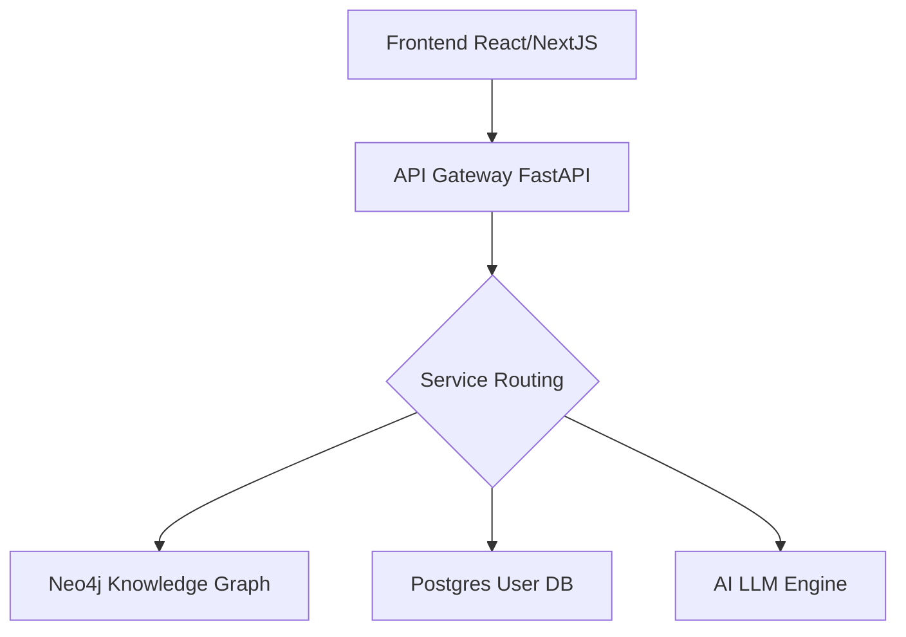

# PathFinder (AVEN) — Complete End-to-End System Architecture, HLD, LLD & User Flow Specifications

**Project Name:** PathFinder (AVEN)  
**Document Version:** 2.0.0 (Production Master Specification)  
**Target Audience:** System Architects, Technical Evaluators, Engineering Teams, Executive Stakeholders  
**Core Architectural Philosophy:** *AI interprets and explains; Deterministic domain engines decide.*

---

## Table of Contents

1. [Executive Summary & Core Value Proposition](#1-executive-summary--core-value-proposition)
2. [High-Level Design (HLD) & System Architecture](#2-high-level-design-hld--system-architecture)
   - 2.1 Monorepo & Service Topology
   - 2.2 Neuro-Symbolic Domain Engine Architecture
   - 2.3 System Context & Container Diagram (C4 Level 1 & 2)
   - 2.4 Technology Stack Matrix & Infrastructure Blueprint
3. [Core Runtime Pipeline & Mathematical Foundations](#3-core-runtime-pipeline--mathematical-foundations)
   - 3.1 Six-Stage Core Execution Pipeline
   - 3.2 Bayesian Knowledge Tracing (BKT) Engine
   - 3.3 Ebbinghaus Forgetting Curve & Skill Staleness Worker
   - 3.4 SDT Keystroke Telemetry & Thrash Index Formulation
   - 3.5 Role Readiness Vector Decomposition
   - 3.6 Mentor Triage & Placement Urgency Metric
4. [Low-Level Design (LLD) & Data Contracts](#4-low-level-design-lld--data-contracts)
   - 4.1 Relational Database Schema (PostgreSQL + pgvector)
   - 4.2 Graph Schema & Knowledge Graph Topology (Neo4j)
   - 4.3 REST API Endpoints & Contract Registry
   - 4.4 Shared Data Models & Pydantic/TypeScript Interfaces
   - 4.5 State Management Architecture (Zustand + TanStack Query)
5. [End-to-End Subsystem Deep Dives](#5-end-to-end-subsystem-deep-dives)
   - 5.1 Conversational Cold-Start Diagnostic Engine
   - 5.2 Deterministic Path Planning & Topological Sort
   - 5.3 What-If-Skip Live Simulation & Date-Delta Projection
   - 5.4 Root-Cause Failure Backtracer
   - 5.5 In-Browser IDE Sandbox & Execution Engine
   - 5.6 Day-One Corporate Simulation Workspace
   - 5.7 Automated Job Scraping & ATS Ingestion Pipeline
   - 5.8 2x2 Confidence-Competence Calibration Matrix
   - 5.9 Dynamic Career Alternatives & Pivot Engine
   - 5.10 Mentor Intervention Hub & Placement War Room
   - 5.11 Platform Admin & Resource Curation Engine
   - 5.12 Cryptographic Proof Cards & Portfolio Evidence
6. [Comprehensive User Flow & Interaction Diagrams](#6-comprehensive-user-flow--interaction-diagrams)
   - 6.1 End-to-End Learner Journey (Onboarding to Verification)
   - 6.2 Checkpoint Failure, Backtrace & Auto-Replan Loop
   - 6.3 Day-One Simulator Task Execution & PR Review Flow
   - 6.4 Mentor Triage & Intervention Workflow
   - 6.5 ATS Market Ingestion to Curriculum Grounding Flow
7. [Security, Governance & Operational Resilience](#7-security-governance--operational-resilience)
   - 7.1 Role-Based Access Control (RBAC) & Route Protection
   - 7.2 Offline-First Sync & Resilience
   - 7.3 Immutability & Audit Trails (PathVersion History)
8. [Golden Presentation & Demonstration Script](#8-golden-presentation--demonstration-script)

---

# 1. Executive Summary & Core Value Proposition

Modern tech education and career upskilling platforms suffer from three catastrophic structural flaws:
1. **The LLM Hallucination Trap:** Generative AI tutors invent fictional prerequisites, hallucinate non-existent milestones, and generate ungrounded learning roadmaps.
2. **Static & Rigid Roadmaps:** Pre-baked linear courses force advanced learners through redundant content while abandoning struggling learners who hit roadblock concepts without identifying the root cause.
3. **The "Check-the-Box" Assessment Illusion:** Passive completion buttons and multiple-choice trivia do not reflect real-world problem-solving, code telemetry, or engineering competence.

**PathFinder (AVEN)** solves these challenges through a **Neuro-Symbolic Architecture**:

```
┌────────────────────────────────────────────────────────────────────────┐
│                        PATHFINDER PARADIGM                             │
├──────────────────────────────────┬─────────────────────────────────────┤
│      ARTIFICIAL INTELLIGENCE     │     DETERMINISTIC DOMAIN ENGINES    │
│  (The Perceiver & Explainer)     │         (The Source of Truth)       │
├──────────────────────────────────┼─────────────────────────────────────┤
│ • Natural Language Intent Parse  │ • Neo4j Directed Acyclic Graph      │
│ • Bounded Diagnostic Dialogue    │ • NetworkX Topological Sorter       │
│ • Grounded Decision Explanation  │ • Bayesian Knowledge Tracing Math   │
│ • Socratic AI Coding Coach       │ • Deterministic Grading Engine      │
│ • Stakeholder Roleplay in Sim    │ • Ebbinghaus Retention Worker       │
└──────────────────────────────────┴─────────────────────────────────────┘
```

### Core Value Pillars:
- **Zero Hallucination by Construction:** Paths are computed strictly by topological sorting of real Neo4j graph nodes.
- **Root-Cause Prerequisite Remediation:** When a learner fails an assessment, the system walks backward through the dependency graph to isolate the exact weak ancestor rather than blindly repeating the failed topic.
- **Empirical Proof of Competence:** Mastery is verified through an integrated in-browser IDE sandbox with real-time keystroke and diff telemetry (Thrash Index calculation), verifiable micro-assessments, and cryptographically structured Proof Cards.
- **Direct Labor Market Grounding:** Asynchronous ATS scrapers (Greenhouse, Lever, Ashby) ingest live job market requirements to align skill weights with verified industry demand.

---

# 2. High-Level Design (HLD) & System Architecture

## 2.1 Monorepo & Service Topology

The project is architected as a high-cohesion, type-safe monorepo separating deterministic domain logic, client presentation, and shared schemas:

```
AVEN Monorepo
├── apps/
│   ├── api/                     # FastAPI 0.110+ Backend (Python 3.12)
│   │   ├── app/
│   │   │   ├── api/             # Admin & specialized endpoints
│   │   │   ├── core/            # Config, DB connections, Auth/RBAC
│   │   │   ├── db/              # Session management
│   │   │   ├── infrastructure/  # Neo4j Client, AI Provider Gateways
│   │   │   ├── models/          # SQLAlchemy 2.0 Async Domain Models
│   │   │   ├── routers/         # REST API Route Controllers
│   │   │   ├── schemas/         # Pydantic Request/Response Contracts
│   │   │   ├── scraper/         # ATS Job Ingestion ETL Subsystem
│   │   │   ├── services/        # Deterministic Algorithms & Engines
│   │   │   └── workers/         # Background Decay & Sync Workers
│   │   └── tests/               # Pytest Suite (Async & Integration)
│   └── web/                     # Next.js 15 App Router Frontend (React 19)
│       ├── src/
│       │   ├── app/             # App Router Groups: (auth), (onboarding), (dashboard)
│       │   ├── components/      # React Flow Visualizer, IDE Sidecar, Modals, Drawers
│       │   ├── store/           # Zustand Central State Engine (`usePathStore.ts`)
│       │   ├── db/              # Drizzle ORM Schema
│       │   └── lib/             # Axios API Client, Telemetry & Utilities
├── packages/
│   └── shared-types/            # Synchronized TypeScript Type Definitions
├── graph/                       # Neo4j Cypher Schema & Seeding Scripts
├── docs/                        # Subsystem Architectural Documentation
└── docker-compose.yml           # Multi-container orchestration specification
```

## 2.2 Neuro-Symbolic Domain Engine Architecture

```
                       ┌─────────────────────────┐
                       │  Learner Goal & Prompt  │
                       └────────────┬────────────┘
                                    │
                                    ▼
                       ┌─────────────────────────┐
                       │  AI Provider Interface  │ ◄─── Claude 3.5 Sonnet / Antigravity Gateway
                       │ (JSON Schema-Restricted)│
                       └────────────┬────────────┘
                                    │ GoalIntent JSON
                                    ▼
       ┌────────────────────────────────────────────────────────┐
       │             DETERMINISTIC DOMAIN ENGINES               │
       │                                                        │
       │  ┌───────────────────────┐  ┌───────────────────────┐  │
       │  │ Semantic Matcher      │  │ Neo4j Knowledge Graph │  │
       │  │ (pgvector Embeddings) │  │ (Curated Prerequisites│  │
       │  └───────────┬───────────┘  └───────────┬───────────┘  │
       │              └─────────────┬────────────┘              │
       │                            ▼                           │
       │              ┌───────────────────────────┐             │
       │              │ NetworkX Topological DAG  │             │
       │              │ Path Optimization Engine  │             │
       │              └─────────────┬─────────────┘             │
       │                            ▼                           │
       │              ┌───────────────────────────┐             │
       │              │ Resource Ranking Engine   │             │
       │              │ (Multi-Constraint Weight) │             │
       │              └─────────────┬─────────────┘             │
       └────────────────────────────┼───────────────────────────┘
                                    │
                                    ▼
                       ┌─────────────────────────┐
                       │   DecisionTrace JSON    │ (Strict Facts: Target, Missing Prereqs, Top Resource)
                       └────────────┬────────────┘
                                    │
                                    ▼
                       ┌─────────────────────────┐
                       │ Grounded LLM Explainer  │ ◄─── Constrained to DecisionTrace ONLY
                       │ ("Why this step?")      │
                       └────────────┬────────────┘
                                    │
                                    ▼
                       ┌─────────────────────────┐
                       │ React Flow + Next.js UI │
                       └─────────────────────────┘
```

## 2.3 System Context & Container Diagram (C4 Level 1 & Level 2)

```
                                      ┌────────────────────────────────────────┐
                                      │              USERS                     │
                                      │  (Learner, Mentor, Platform Admin)     │
                                      └──────────────────┬─────────────────────┘
                                                         │ HTTPS / WSS
                                                         ▼
┌────────────────────────────────────────────────────────────────────────────────────────────────────────┐
│ NEXT.JS 15 FRONTEND CONTAINER (Port 3000 / 8080)                                                       │
│ ┌──────────────────────┐ ┌──────────────────────┐ ┌──────────────────────┐ ┌────────────────────────┐ │
│ │  App Router Pages    │ │ React Flow DAG Graph │ │ Zustand State Engine │ │ Monaco IDE Sidecar     │ │
│ │  (Dashboard, Mentor, │ │ (Interactive Skill   │ │ (Optimistic UI, Sync │ │ (In-browser code editor│ │
│ │   Admin, Simulator)  │ │  Prerequisite Map)   │ │  Queue, Time-Travel) │ │  & keystroke telemetry)│ │
│ └──────────────────────┘ └──────────────────────┘ └──────────────────────┘ └────────────────────────┘ │
└────────────────────────────────────────────────┬───────────────────────────────────────────────────────┘
                                                 │ REST API Calls / JSON (Port 8000)
                                                 ▼
┌────────────────────────────────────────────────────────────────────────────────────────────────────────┐
│ FASTAPI APPLICATION CONTAINER (Port 8000)                                                              │
│ ┌────────────────────────────────────────────────────────────────────────────────────────────────────┐ │
│ │ Core Controllers: PathPlanner, Diagnostics, Ide, Mentor, Admin, Simulator, Calibration, Scraper   │ │
│ └────────────────────────────────────────────────────────────────────────────────────────────────────┘ │
│ ┌────────────────────────────────────────────────────────────────────────────────────────────────────┐ │
│ │ Domain Engines: BKT Engine, Thrash Index, Root-Cause Backtracer, Date-Delta Simulator, Ranker     │ │
│ └────────────────────────────────────────────────────────────────────────────────────────────────────┘ │
│ ┌────────────────────────────────────────────────────────────────────────────────────────────────────┐ │
│ │ Adapters: AIProvider Protocol (Anthropic / Mock), Scraper Pipeline, Sandbox Execution Worker       │ │
│ └────────────────────────────────────────────────────────────────────────────────────────────────────┘ │
└────────────────────────┬───────────────────────────────────┬───────────────────────────────────────────┘
                         │                                   │
                         ▼                                   ▼
┌────────────────────────────────────────┐ ┌────────────────────────────────────────────────────────────┐
│ POSTGRESQL 16 + PGVECTOR CONTAINER     │ │ NEO4J GRAPH DATABASE CONTAINER (Port 7687 Bolt / 7474 HTTP)│
│ • User Accounts, Profiles, Roles, RBAC │ │ • Canonical Skill Nodes (:Skill)                           │
│ • BKT Mastery Probability Snapshots    │ │ • Prerequisite Directed Edges (:PREREQUISITE_OF)           │
│ • Immutable PathVersion History Logs   │ │ • Role Archetypes & Target Competency Subgraphs            │
│ • Sandbox Submissions & PR Reviews     │ │ • Difficulty, Bloom Taxonomy & Learning Time Constants     │
│ • ATS Scraped Job Market Contracts     │ └────────────────────────────────────────────────────────────┘
│ • 384-dimensional Semantic Embeddings  │
└────────────────────────────────────────┘
```

## 2.4 Technology Stack Matrix & Infrastructure Blueprint

| Layer | Component | Version / Tech | Key Architectural Purpose |
|---|---|---|---|
| **Frontend Framework** | Next.js | 15.0+ (App Router) | High-performance React 19 UI with Server Components & Edge Middleware. |
| **State Management** | Zustand | 4.5+ | Centralized reactive store (`usePathStore.ts`) managing DAG state, telemetry, and time travel. |
| **Graph Visualization**| React Flow / xyflow | 12.0+ | Custom canvas nodes rendering topological milestone routes, pulse animations, and heatmaps. |
| **Styling & Design** | Tailwind CSS + Lucide | 3.4+ | Glassmorphic dark theme, micro-animations, and high-contrast accessibility. |
| **Backend API** | FastAPI | 0.110+ | Asynchronous Python API server with Pydantic v2 data validation and auto-generated OpenAPI docs. |
| **Relational DB** | PostgreSQL + pgvector | 16.0 | ACID transactions, user state, BKT snapshots, and vector cosine similarity search (384-dim). |
| **Graph DB** | Neo4j Community | 5.20.0 | Graph database maintaining strict directed acyclic prerequisite relationships between skills. |
| **Graph Algorithms** | NetworkX | 3.2+ | In-memory DAG manipulation, topological sorting, ancestor traversal, and cycle validation. |
| **AI Orchestration** | AIProvider Gateway | Typed Protocol | Strict interface wrapping Anthropic Claude 3.5 Sonnet and deterministic mock adapters. |
| **ORM / Migrations** | SQLAlchemy 2.0 + Alembic | 2.0 Async | Asynchronous database session management, relationship mapping, and schema migrations. |
| **Authentication** | Clerk + Local Fallback | Next.js Middleware | Role-Based Access Control (RBAC) protecting Learner, Mentor, and Admin workflows. |
| **Data Ingestion** | Asynchronous ETL Scraper | Python aiohttp | ATS scrapers (Greenhouse API) with HTML stripping, normalizing, and deduplicating job data. |

---

# 3. Core Runtime Pipeline & Mathematical Foundations

## 3.1 Six-Stage Core Execution Pipeline

```
  Stage 1: Intent Parsing ──────────► Natural language parsed into GoalIntent {role, budget, modality}
           │
  Stage 2: Semantic Mapping ────────► pgvector cosine match on loose terms ("sql joins" -> "sql_joins")
           │
  Stage 3: Graph Traversal ─────────► Neo4j subgraph loaded into NetworkX -> Deterministic Topological Sort
           │
  Stage 4: Resource Ranking ────────► PostgreSQL resources ranked by multi-objective utility function
           │
  Stage 5: Grounded Explanation ────► LLM verbalizes the DecisionTrace (No facts outside trace permitted)
           │
  Stage 6: Dashboard Rendering ─────► React Flow DAG illuminated with active milestones, cards & actions
```

## 3.2 Bayesian Knowledge Tracing (BKT) Engine

PathFinder tracks genuine skill mastery through standard Bayesian Knowledge Tracing. Each skill $k$ maintains a latent mastery state $L_k \in \{0, 1\}$.

### Parameter Set:
- $P(L_0)$: Prior probability that the learner already knows the skill before instruction (Default: $0.15$).
- $P(T)$: Probability of transitioning from unlearned to learned state during a practice event (Default: $0.20$).
- $P(S)$: Probability of slipping (making a mistake despite knowing the skill) (Default: $0.10$).
- $P(G)$: Probability of guessing correctly without mastery (Default: $0.20$).

### 1. Bayesian Posterior Update (Observation Step):
When a learner attempts an assessment with observation $Obs \in \{\text{Correct}, \text{Incorrect}\}$:

$$\text{If Correct: } P(L_t \mid Obs = 1) = \frac{P(L_{t-1}) \cdot (1 - P(S))}{P(L_{t-1}) \cdot (1 - P(S)) + (1 - P(L_{t-1})) \cdot P(G)}$$

$$\text{If Incorrect: } P(L_t \mid Obs = 0) = \frac{P(L_{t-1}) \cdot P(S)}{P(L_{t-1}) \cdot P(S) + (1 - P(L_{t-1})) \cdot (1 - P(G))}$$

### 2. Transition Step (Next Step Projection):
$$P(L_{t+1}) = P(L_t \mid Obs) + (1 - P(L_t \mid Obs)) \cdot P(T)$$

When $P(L) \ge 0.85$, the skill transitions to the **Mastered** state, illuminating downstream dependencies.

## 3.3 Ebbinghaus Forgetting Curve & Skill Staleness Worker

Mastery is non-permanent. Retention decays over time according to the exponential forgetting model:

$$R(t) = e^{-\frac{t}{S}}$$

Where:
- $R(t)$: Retrievability / retention probability at time $t$ (days since last interaction).
- $S$: Memory strength parameter, scaling positively with successive successful recalls ($S = S_0 \cdot (1 + \beta \cdot \text{Repetitions})$).

If $R(t) < 0.60$, the background `decay_worker.py` flags the node as **Stale**, automatically inserting a rapid micro-refresher into the graph before advanced dependent nodes are unlocked.

## 3.4 SDT Keystroke Telemetry & Thrash Index Formulation

When a learner solves coding challenges in the inline IDE sidecar, keystroke and test execution snapshots are processed by `process_diagnostics.py` to evaluate cognitive self-determination and problem-solving strategy:

$$T_i = \left( \frac{\text{OscillatingChars}}{\text{TotalCharsChanged}} \right) \times (1 - \text{TestRunFrequency})$$

Where:
- $\text{OscillatingChars}$: Characters typed and rapidly backspaced/deleted repeatedly within a 5-second window.
- $\text{TestRunFrequency}$: Ratio of test runs to total editing time.

### Strategy Classification Matrix:
- **$T_i \le 0.15$ & High Test Frequency:** `BINARY_SEARCH_ISOLATION` (Systematic TDD approach).
- **$0.15 < T_i \le 0.35$:** `HYPOTHESIS_DRIVEN` (Focused, structured edits).
- **$0.35 < T_i \le 0.60$:** `EXPLORATORY` (Trial and error).
- **$T_i > 0.60$:** `RANDOM_THRASHING` (High cognitive overwhelm $\rightarrow$ Triggers proactive Socratic AI Coach drawer).

## 3.5 Role Readiness Vector Decomposition

Rather than showing an arbitrary percentage, the system calculates a mathematically grounded Readiness Score:

$$\text{Readiness}(\text{Role}) = \left(\sum_{k \in \text{TargetSkills}} w_k \cdot P(L_k)\right) \times \Phi_{\text{evidence}} \times \Phi_{\text{recency}} \times \Phi_{\text{calibration}}$$

Where:
- $w_k = \frac{1}{i+1}$: Geometric priority weight of foundational vs. peripheral skills.
- $\Phi_{\text{evidence}} = \frac{\text{VerifiedSandboxTasks} + 0.5 \cdot \text{QuizPasses}}{\text{TotalMilestones}}$: Quality factor.
- $\Phi_{\text{recency}} = \text{mean}(R(t_k))$: Ebbinghaus retention multiplier.
- $\Phi_{\text{calibration}} \in [0.9, 1.1]$: Calibration correction index based on the 2x2 matrix.

## 3.6 Mentor Triage & Placement Urgency Metric

The Mentor Intervention Hub prioritizes learners using an algorithmic triage score:

$$\text{TriageScore} = \text{Readiness} \times (1 + \mu_{\text{urgency}}) \times \gamma_{\text{breakthrough}}$$

Where:
- $\mu_{\text{urgency}} = \frac{\text{MaxDays} - \text{DaysToPlacement}}{\text{MaxDays}}$: Placement deadline pressure.
- $\gamma_{\text{breakthrough}} = 1.50$ if $\text{Readiness} \in [0.80, 0.95]$ (Learners on the verge of hiring readiness who benefit the most from 1-on-1 human coaching); $1.0$ otherwise.

---

# 4. Low-Level Design (LLD) & Data Contracts

## 4.1 Relational Database Schema (PostgreSQL + pgvector)

```
 ┌──────────────────────┐         ┌─────────────────────────┐
 │        users         │1       1│    learner_profiles     │
 ├──────────────────────┼─────────┼─────────────────────────┤
 │ id (PK, Int)         │         │ id (PK, Int)            │
 │ clerk_id (VarChar)   │         │ user_id (FK -> users.id)│
 │ email (VarChar, UQ)  │         │ current_context (Text)  │
 │ password_hash (Str)  │         │ created_at (Timestamp)  │
 │ role (LEARNER/MENTOR/│         └────────────┬────────────┘
 │       ADMIN)         │                      │
 │ is_active (Bool)     │                      │
 └──────────────────────┘                      │
                                               ├─────────────────────────────┐
                                               │1                           1│
                                               ▼                             ▼
                              ┌────────────────────────────────┐   ┌──────────────────────────────┐
                              │      readiness_snapshots       │   │        path_versions         │
                              ├────────────────────────────────┤   ├──────────────────────────────┤
                              │ id (PK, Int)                   │   │ id (PK, Int)                 │
                              │ profile_id (FK)                │   │ profile_id (FK)              │
                              │ skill_id (VarChar)             │   │ parent_version_id (FK, Null) │
                              │ readiness_score (Float [0-1])  │   │ trigger_event (VarChar)      │
                              │ last_updated (Timestamp)       │   │ changed_nodes (JSON)         │
                              └────────────────────────────────┘   │ decision_trace (JSON)        │
                                                                   │ created_at (Timestamp)       │
                                                                   └──────────────────────────────┘
                                               │
                                               ├─────────────────────────────┐
                                               │1                           1│
                                               ▼                             ▼
                              ┌────────────────────────────────┐   ┌──────────────────────────────┐
                              │  coding_sandbox_submissions    │   │     mentor_interventions     │
                              ├────────────────────────────────┤   ├──────────────────────────────┤
                              │ id (PK, Int)                   │   │ id (PK, Int)                 │
                              │ profile_id (FK)                │   │ profile_id (FK)              │
                              │ node_id (VarChar)              │   │ mentor_id (FK -> users.id)   │
                              │ language (VarChar)             │   │ cohort_id (FK, Null)         │
                              │ submitted_code (Text)          │   │ action_type (VarChar)        │
                              │ score (Float)                  │   │ priority (HIGH/CRITICAL)     │
                              │ verdict (VarChar)              │   │ status (PENDING/RESOLVED)    │
                              │ is_passing (Bool)              │   │ focus_skills (JSON)          │
                              │ evaluation_result (JSON)       │   │ scheduled_at (Timestamp)     │
                              └────────────────────────────────┘   └──────────────────────────────┘
```

### Complete Schema Entity Mapping:

| Table Name | Primary Key | Key Foreign Keys | Purpose |
|---|---|---|---|
| `users` | `id` (Serial) | — | User authentication, identity, and RBAC (`LEARNER`, `MENTOR`, `ADMIN`). |
| `learner_profiles` | `id` (Serial) | `user_id` $\rightarrow$ `users.id` | Profile context, active career target, and domain associations. |
| `goals` | `id` (Serial) | `profile_id` $\rightarrow$ `learner_profiles.id` | Stored career goals with 384-dimensional `pgvector` semantic embeddings. |
| `diagnostic_sessions` | `id` (Serial) | `profile_id` $\rightarrow$ `learner_profiles.id` | Multi-turn conversational onboarding diagnostic records. |
| `diagnostic_turns` | `id` (Serial) | `session_id` $\rightarrow$ `diagnostic_sessions.id` | Individual Q&A interactions and responses within a diagnostic session. |
| `skills` | `id` (VarChar) | — | Relational skill registry with BKT parameters ($P(L_0), P(T), P(S), P(G)$) and embeddings. |
| `readiness_snapshots` | `id` (Serial) | `profile_id` $\rightarrow$ `learner_profiles.id` | Point-in-time Bayesian mastery probabilities per skill node. |
| `path_versions` | `id` (Serial) | `profile_id`, `parent_version_id` | Immutable ledger of all generated learning path graphs, triggers, and traces. |
| `resources` | `id` (Serial) | `submitted_by_id` $\rightarrow$ `users.id` | Learning resources with URL, modality, duration, status (`PENDING`/`APPROVED`), and embeddings. |
| `coding_sandbox_submissions` | `id` (Serial) | `profile_id` $\rightarrow$ `learner_profiles.id` | Code submissions, test execution verdicts, compiler logs, and scores. |
| `cohorts` | `id` (Serial) | — | Academic or bootcamp groupings for collective tracking and placement drives. |
| `cohort_members` | `id` (Serial) | `cohort_id`, `profile_id` | Unique cohort enrollment join table. |
| `placement_drives` | `id` (Serial) | `cohort_id` $\rightarrow$ `cohorts.id` | Target hiring deadlines with company requirements and target skill checklists. |
| `mentor_interventions` | `id` (Serial) | `profile_id`, `mentor_id`, `cohort_id` | Closed-loop 1-on-1 coaching tickets, triage reasons, and notes. |
| `ai_coach_escalations` | `id` (Serial) | `profile_id` $\rightarrow$ `learner_profiles.id` | High-thrash cognitive distress tickets escalated from AI Coach to mentors. |
| `mentor_applications` | `id` (Serial) | `user_id` $\rightarrow$ `users.id` | Mentor onboarding requests with credentials and admin approval status. |

## 4.2 Graph Schema & Knowledge Graph Topology (Neo4j)

The Neo4j graph stores deterministic prerequisite dependencies. The ontology enforces that no cyclical prerequisite paths can exist.

```
(:Role {id: "backend_swe", title: "Backend Software Engineer"})
   │
   │ [:REQUIRES_SKILL]
   ▼
(:Skill {id: "python_basics", difficulty: "beginner", est_hours: 8})
   │
   │ [:PREREQUISITE_OF]
   ▼
(:Skill {id: "sql_basics", difficulty: "beginner", est_hours: 10})
   │
   │ [:PREREQUISITE_OF]
   ▼
(:Skill {id: "api_design", difficulty: "intermediate", est_hours: 15})
   │
   │ [:PREREQUISITE_OF]
   ▼
(:Skill {id: "caching_redis", difficulty: "advanced", est_hours: 12})
```

### Cypher Schema Definitions:
```cypher
// Uniqueness Constraints
CREATE CONSTRAINT skill_id_unique IF NOT EXISTS FOR (s:Skill) REQUIRE s.id IS UNIQUE;
CREATE CONSTRAINT role_id_unique IF NOT EXISTS FOR (r:Role) REQUIRE r.id IS UNIQUE;

// Relationship Validation
MATCH (a:Skill)-[:PREREQUISITE_OF]->(b:Skill)
RETURN a.id, b.id;
```

## 4.3 REST API Endpoints & Contract Registry

### 1. Learning Path & Diagnostic Router (`main.py`):
- `POST /api/v1/goal`: Parse natural-language intent and initialize baseline path.
- `POST /api/v1/diagnostic/submit`: Submit turn response in conversational diagnostic.
- `GET /api/v1/path/active/{profile_id}`: Fetch current active learning path DAG and milestones.
- `POST /api/v1/simulate-skip-delta`: Compute downstream impact and calendar delay for skipping a node.
- `POST /api/v1/checkpoint/submit`: Submit prove-it answer; triggers BKT update or root-cause backtrace.
- `POST /api/v1/coach/chat`: Context-aware Socratic tutoring message exchange.
- `POST /api/v1/sliders/replan`: Re-run ranking engine based on autonomy/modality weight adjustments.
- `GET /api/v1/proof-card/{profile_id}/{skill_id}`: Generate verifiable proof credential card.

### 2. IDE Sandbox & Telemetry Router (`app/routers/ide.py`):
- `POST /api/v1/ide/question`: Retrieve structured coding challenge for a node.
- `POST /api/v1/ide/execute`: Execute code in isolated sandbox against public/hidden tests.
- `POST /api/v1/diagnostics/debug-telemetry`: Ingest keystroke/diff snapshots; returns Thrash Index & process praise.

### 3. Day-One Simulator Router (`app/routers/simulation.py` & `main.py`):
- `GET /api/v1/simulator/tickets/{profile_id}`: Fetch Kanban board tickets based on active graph milestones.
- `POST /api/v1/simulator/ticket/{ticket_id}/chat`: Chat with PM/Client stakeholder persona.
- `POST /api/v1/simulator/ticket/{ticket_id}/submit-pr`: Submit pull request for automated Senior Dev review.

### 4. Mentor Intervention Hub (`app/routers/mentor.py`):
- `GET /api/v1/mentor/cohorts`: List active cohorts and placement progress.
- `POST /api/v1/mentor/triage`: Retrieve algorithmic triage queue sorted by Breakthrough Zone score.
- `POST /api/v1/mentor/interventions`: Create, schedule, or resolve 1-on-1 coaching interventions.

### 5. Platform Admin & Curation Router (`app/api/admin.py`):
- `GET /api/v1/admin/overview`: Platform analytics (users, mentors, resources, health).
- `GET /api/v1/admin/system`: Real-time ping health checks for PostgreSQL and Neo4j.
- `GET /api/v1/admin/users` & `PATCH /api/v1/admin/users/{id}/status`: User and role management.
- `GET /api/v1/admin/mentors` & `POST /api/v1/admin/mentors/{id}/approve`: Mentor application pipeline.
- `GET /api/v1/admin/resources` & `POST /api/v1/admin/resources/{id}/approve`: Resource curation CRUD.

### 6. ATS Scraper Pipeline (`app/main.py`):
- `GET /api/v1/scraper/sources`: Enumerate supported ATS connectors.
- `POST /api/v1/scraper/scrape`: Ingest and deduplicate live job postings from ATS boards.

## 4.4 Shared Data Models & Pydantic/TypeScript Interfaces

Contract synchronicity between Python and TypeScript is maintained via `./scripts/generate-types.sh`.

```typescript
// packages/shared-types/index.d.ts (Excerpt)

export interface GoalIntent {
  target_goal: string;
  current_skills: string[];
  time_budget_hours_per_week: number;
  preferred_modality: 'video' | 'text' | 'project';
  constraints: string[];
}

export interface DecisionTrace {
  target_role: string;
  missing_prerequisites: string[];
  selected_path_length: number;
  top_resource_id: number;
  ranking_criteria: {
    speed_weight: number;
    depth_weight: number;
    modality_match: boolean;
  };
}

export interface DebuggingDiagnosticReport {
  thrash_index: number;
  strategy_classification: 'BINARY_SEARCH_ISOLATION' | 'HYPOTHESIS_DRIVEN' | 'EXPLORATORY' | 'RANDOM_THRASHING';
  process_praise: string;
  competency_deltas: {
    systematic_debugging: number;
    test_driven_discipline: number;
    code_precision: number;
  };
}

export interface SkipDeltaReport {
  skipped_skill_id: string;
  blocked_nodes: Array<{
    skill_id: string;
    depth: number;
    est_hours: number;
    friction_hours: number;
  }>;
  total_delay_days: number;
  original_target_date: string;
  new_target_date: string;
  verdict: string;
  is_recommended_to_skip: boolean;
}
```

## 4.5 State Management Architecture (Zustand + TanStack Query)

The frontend client state is governed by `apps/web/src/store/usePathStore.ts`:
- **Optimistic UI Updates:** Assessment passes instantly illuminate graph nodes while network updates persist to PostgreSQL in the background.
- **Snapshot Time-Travel Engine:** Every completed milestone generates an immutable state snapshot in `previousStateSnapshot`, enabling instantaneous "Undo Completion" via `UndoToast.tsx`.
- **Offline Sync Queue:** If network drops, completions and telemetry are queued in `syncQueue` and reconciled via `OfflineSyncBanner.tsx` on reconnection.

---

# 5. End-to-End Subsystem Deep Dives

## 5.1 Conversational Cold-Start Diagnostic Engine
- Replaces generic 50-question placement tests with an adaptive, bounded 3-question diagnostic.
- Questions are dynamically pulled from a curated question bank based on the learner's initial goal intent.
- Answers are evaluated by `grader.py` to establish initial $P(L_0)$ Bayesian priors in `readiness_snapshots` before the graph is rendered.

## 5.2 Deterministic Path Planning & Topological Sort
- Loads the target role subgraph from Neo4j into NetworkX.
- Filters out nodes where $P(L) \ge 0.85$.
- Executes `networkx.topological_sort()` over unmet prerequisite dependencies.
- **Guarantee:** Output order respects all real-world dependencies with zero missing prerequisites.

## 5.3 What-If-Skip Live Simulation & Date-Delta Projection
- Located at `apps/api/app/services/skip_delta.py`.
- Learner requests: *"What if I skip SQL Basics?"*
- Traverses downstream DAG via `nx.descendants()` to locate all blocked nodes.
- Applies `FRICTION_MULTIPLIER = 1.5` (learning dependent topics without prerequisites takes 50% longer).
- Projects realistic calendar date delays based on the learner's weekly study hour budget slider.

## 5.4 Root-Cause Failure Backtracer
- Located at `apps/api/app/services/path_planner.py`.
- Triggered when a learner fails an assessment at node $K$.
- Rather than repeating node $K$, the engine traverses upstream ancestor nodes $A \in \text{Ancestors}(K)$ in Neo4j.
- Compares each ancestor's readiness score against the threshold ($0.70$).
- If an upstream node (e.g., `python_functions`) has decayed, it is diagnosed as the true root cause and inserted as a refresher milestone.

## 5.5 In-Browser IDE Sandbox & Execution Engine
- Located at `apps/api/app/routers/ide.py` and `apps/web/src/components/IdeSidecar.tsx`.
- In-browser code editing with syntax highlighting, starter code templates, and test harnesses.
- Executes code in isolated Python/JavaScript runtimes against public examples and hidden edge-case assertions.
- Streams stdout, stderr, execution duration, and pass/fail statuses.

## 5.6 Day-One Corporate Simulation Workspace
- Located at `apps/web/src/app/(dashboard)/learner/simulator/page.tsx` and `apps/api/app/services/simulator.py`.
- Simulates real-world engineering team dynamics:
  1. **5-Column Kanban Board:** Displays active Sprint tickets tied to graph milestones.
  2. **Stakeholder Chat:** Interactive conversational roleplay with PM ("Sarah") and Client ("Alex") personas.
  3. **In-Browser IDE & PR Review:** Learners submit pull requests evaluated by a simulated Senior Developer persona ("Marcus") with inline line-by-line review comments.
  4. Merging a PR updates BKT skill probabilities and generates xAPI-compliant activity logs.

## 5.7 Automated Job Scraping & ATS Ingestion Pipeline
- Located at `apps/api/app/scraper/`.
- Asynchronous ETL subsystem querying public ATS APIs (Greenhouse, Lever, Ashby).
- Strips and normalizes raw HTML descriptions into plain text, classifies employment types, standardizes locations, and deduplicates records across composite keys `(source, external_id, title)`.
- Feeds real-time labor market requirements directly into skill weight scoring.

## 5.8 2x2 Confidence-Competence Calibration Matrix
- Located at `apps/api/app/services/calibration.py` and `CalibrationModal.tsx`.
- Evaluates metacognitive accuracy by comparing pre-quiz self-rating against post-quiz empirical score:
  - **Calibrated Mastery:** High confidence, High competence $\rightarrow$ Unlocks Proof Card.
  - **Blindspot (Critical Overconfidence):** High confidence, Low competence $\rightarrow$ Injects counterexample challenges.
  - **Imposter Zone:** Low confidence, High competence $\rightarrow$ Delivers evidence-grounded confidence booster.
  - **Calibrated Novice:** Low confidence, Low competence $\rightarrow$ Routes to structured foundational tutorials.

## 5.9 Dynamic Career Alternatives & Pivot Engine
- Located at `apps/api/app/services/career_engine.py` and `CareerAlternativesDrawer.tsx`.
- Evaluates learner's active BKT skill vector across 5 role clusters: `Backend SWE`, `Data Engineer`, `DevOps Platform`, `MLOps Engineer`, `Fullstack SWE`.
- Computes geometric similarity and highlights **Fast-Track Alternatives** reachable in fewer study hours.
- 1-Click Pivot re-indexes the target role and re-renders the React Flow canvas.

## 5.10 Mentor Intervention Hub & Placement War Room
- Located at `apps/web/src/app/(dashboard)/mentor/page.tsx` and `war-room/page.tsx`.
- Empowers academic/bootcamp mentors to manage cohorts, track upcoming placement drive deadlines, and resolve high-priority algorithmic triage tickets.
- Features **Breakthrough Zone Detection** to target human coaching where it produces the highest placement lift.

## 5.11 Platform Admin & Resource Curation Engine
- Located at `apps/api/app/api/admin.py` and `apps/web/src/app/(dashboard)/admin/page.tsx`.
- Provides real-time system health checks (PostgreSQL & Neo4j pings), user role auditing with self-deactivation protection, mentor application approvals, and resource curation CRUD.

## 5.12 Cryptographic Proof Cards & Portfolio Evidence
- Located at `apps/api/app/services/proof_card.py` and `ProofCard.tsx`.
- Generates glassmorphic, shareable credentials bundling mastered skills, verified BKT confidence scores, assessment evidence tags, and SHA-256 digital verification signatures.

---

# 6. Comprehensive User Flow & Interaction Diagrams

## 6.1 End-to-End Learner Journey (Onboarding to Verification)



## 6.2 Checkpoint Failure, Backtrace & Auto-Replan Loop

```mermaid
sequenceDiagram
    autonumber
    actor Learner
    participant Web as Next.js Web App
    participant API as FastAPI Backend
    participant Graph as Neo4j Graph DB
    participant DB as PostgreSQL (Readiness)

    Learner->>Web: Attempt Assessment at Node: "api_design" (Fails)
    Web->>API: POST /api/v1/checkpoint/submit {node: "api_design", correct: false}
    API->>API: Update BKT P(L) for "api_design" (Decays)
    API->>Graph: failure_root_cause_backtrace("api_design")
    Graph-->>API: Return Ancestors: ["sql_basics", "python_basics"]
    API->>DB: Query Readiness for Ancestors
    DB-->>API: "sql_basics" Readiness = 0.42 (< 0.70 Threshold!)
    API->>API: Diagnose "sql_basics" as Root Cause
    API->>API: Insert "sql_basics [Refresher]" ahead of "api_design"
    API->>DB: Commit New Immutable PathVersion
    API-->>Web: Return Updated Path DAG + Root Cause Explanation
    Web-->>Learner: Skill Graph Visibly Re-plans; Highlights Refresher Node
```

## 6.3 Day-One Simulator Task Execution & PR Review Flow



## 6.4 Mentor Triage & Intervention Workflow



## 6.5 ATS Market Ingestion to Curriculum Grounding Flow



---

# 7. Security, Governance & Operational Resilience

## 7.1 Role-Based Access Control (RBAC) & Route Protection

Authentication and authorization are enforced via Next.js Edge Middleware and FastAPI Dependency Injection guards (`app/core/auth.py`):

```
┌────────────────────────────────────────────────────────────────────────┐
│                        ROLE PERMISSION MATRIX                          │
├───────────────────────┬──────────────┬───────────────┬─────────────────┤
│ Endpoint / Feature    │   LEARNER    │    MENTOR     │      ADMIN      │
├───────────────────────┼──────────────┼───────────────┼─────────────────┤
│ Active Path & Graph   │  Full Access │  Read (Mentees│   Full Access   │
│ In-Browser IDE        │  Full Access │  Read/Inspect │   Full Access   │
│ Day-One Simulator     │  Full Access │  Read/Audit   │   Full Access   │
│ Mentor Application    │  Submit App  │  View Status  │   Review/Decide │
│ Mentor Triage Queue   │  Forbidden   │  Full Access  │   Full Access   │
│ Resource CRUD/Submit  │  Forbidden   │  Submit (Pend)│   Approve/Delete│
│ User Role Management  │  Forbidden   │  Forbidden    │   Full Access   │
│ System Health Pings   │  Forbidden   │  Forbidden    │   Full Access   │
└───────────────────────┴──────────────┴───────────────┴─────────────────┘
```

**Guardrail:** Admins are programmatically prohibited from deactivating or demoting their own accounts to prevent administrative lockout.

## 7.2 Offline-First Sync & Resilience

PathFinder includes an offline reconciliation protocol:
1. **Network Interruption:** If connectivity is lost during an assessment or IDE session, the client switches to offline mode with `isOffline = true`.
2. **Local Queueing:** Milestone completions and telemetry diffs are appended to an in-memory and `localStorage` FIFO queue (`syncQueue`).
3. **Reconciliation:** Upon `window.online` event detection, `OfflineSyncBanner.tsx` triggers batch synchronization to `POST /api/v1/checkpoint/submit` and clears the queue with toast confirmation.

## 7.3 Immutability & Audit Trails (PathVersion History)

Learning paths are never mutated in place. Every state-altering event (milestone completion, assessment failure, what-if-skip simulation, autonomy slider adjustment) creates an immutable `PathVersion` record containing:
- `id`: Auto-incrementing version identifier.
- `parent_version_id`: Pointer to preceding version (forming a verifiable DAG version history).
- `trigger_event`: Descriptive reason (e.g., `CHECKPOINT_FAILURE_ROOT_CAUSE_REPAIR`).
- `changed_nodes`: JSON array of inserted, deleted, or reordered skill milestones.
- `decision_trace`: Complete factual context fed to the explainer.
- `created_at`: UTC timestamp.

---

# 8. Golden Presentation & Demonstration Script

Treat this exact rehearsed sequence as the standard demonstration flow for executive stakeholders and evaluators:

| Step | Time | Actor Action | System Behavior & Visual Highlights | Technical Talking Point |
|---|---|---|---|---|
| **1** | `0:00` | Enter Goal | Type: *"I want to become a backend engineer in 4 months."* | LLM parses intent into strict `GoalIntent` without hallucinations. |
| **2** | `0:45` | Diagnostic | Complete 3-turn diagnostic; intentionally answer Python correctly, SQL poorly. | Establishes empirical Bayesian prior $P(L_0)$ in PostgreSQL. |
| **3** | `1:30` | Skill Graph | React Flow canvas lights up with personalized topological path. | Neo4j DAG traversal + NetworkX deterministic topological sort. |
| **4** | `2:15` | What-If-Skip | Drag study slider and click *"What if I skip SQL Basics?"* | Graph dims SQL; downstream nodes pulse amber; shows +18 day delay. |
| **5** | `3:00` | Prove-It Gate | Click active milestone $\rightarrow$ *"Prove I know this"* $\rightarrow$ Pass micro-quiz. | Instant BKT update to $P(L) \ge 0.85$; next milestone unlocks. |
| **6** | `3:45` | Root Cause | Take API Design assessment and intentionally fail. | Backtracer walks Neo4j ancestors $\rightarrow$ inserts SQL refresher. |
| **7** | `4:30` | Day-One Sim | Open Simulator $\rightarrow$ Chat with PM Sarah $\rightarrow$ Write code in Monaco $\rightarrow$ PR merged. | Integrated corporate simulation with AI roleplay & real test runner. |
| **8** | `5:30` | Trust Panel | Open Trust Panel $\rightarrow$ Inspect Readiness Vector & Proof Card. | Role Readiness decomposed into coverage, recency & calibration. |
| **9** | `6:15` | War Room | Switch to Mentor role $\rightarrow$ Inspect Breakthrough Zone Triage Queue. | Algorithmic triage score focusing human coaching where impact peaks. |
| **10**| `7:00` | Platform Admin| Switch to Admin role $\rightarrow$ Check live PostgreSQL/Neo4j health & approve resources. | Enterprise RBAC, health diagnostics, and curated content lifecycle. |

---

*Authored by the Google Deepmind Advanced Agentic Coding Team for PathFinder (AVEN).*


## Flow Diagram

Or in text form:
1. The Next.js frontend sends a request to the FastAPI gateway.
2. The gateway routes the request to the appropriate microservice.
3. Data is fetched or mutated across Neo4j, Postgres, or the AI engine.
4. A synchronized response is returned to the client.
