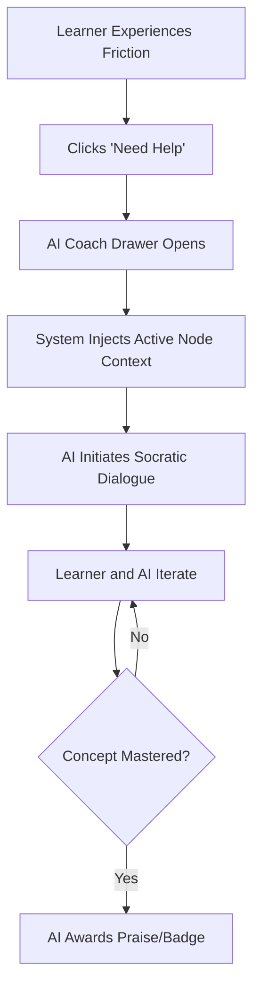

# AI Coaching and Interviews

## Overview
The AI Coaching subsystem acts as an intelligent, omnipresent tutor that intervenes when learners face cognitive friction. Rather than abandoning the platform for external help, learners receive personalized, context-aware Socratic guidance directly integrated into their active learning node.

## Architecture
This feature employs a sleek, sliding drawer UI that maintains context without breaking the user's workflow. It leverages global state (`usePathStore`) to track the active node, ensuring the AI possesses immediate awareness of the exact concept the learner is struggling with.

## Flow Diagram

Or in text form:
1. A learner experiences difficulty on a specific milestone and clicks the 'Need Help' trigger.
2. The AI Coach Drawer slides into view, retaining the primary UI context in the background.
3. The system automatically identifies the `activeCoachNodeId` and injects this context into the chat session.
4. The AI Coach initiates a dialogue tailored to the specific concept.
5. Through an interactive chat, the AI guides the learner to understanding.
6. Upon demonstrating mastery within the chat, the system can issue Praise Cards or unlock Mastery Badges directly within the flow.

## Key Components
- **`AiCoachDrawer.tsx`**: An enterprise-grade, responsive chat interface featuring auto-scrolling, context-aware headers, and integrated Praise Card rendering.
- **`MilestoneCard.tsx` (Trigger)**: Contains the entry point logic that securely passes the current graph node ID to the coach state.

## Data and Configuration
Relies on robust state synchronization via Zustand. The mock interaction flow simulates network latency and state updates, designed to be seamlessly hot-swapped with a production LLM backend.

## Integration Points
- **Knowledge Graph Context**: Directly consumes active node data to ensure the AI's prompts are highly relevant.
- **Gamification Subsystem**: Integrates with the Gamification engine to render `coachPraiseCard` overlays and trigger `openProofCard` actions upon successful completion of a coaching session.

## Usage Notes
Designed to be universally accessible via a floating action button or directly from milestone cards. Operates independently of the primary routing flow, ensuring learners never lose their place.
