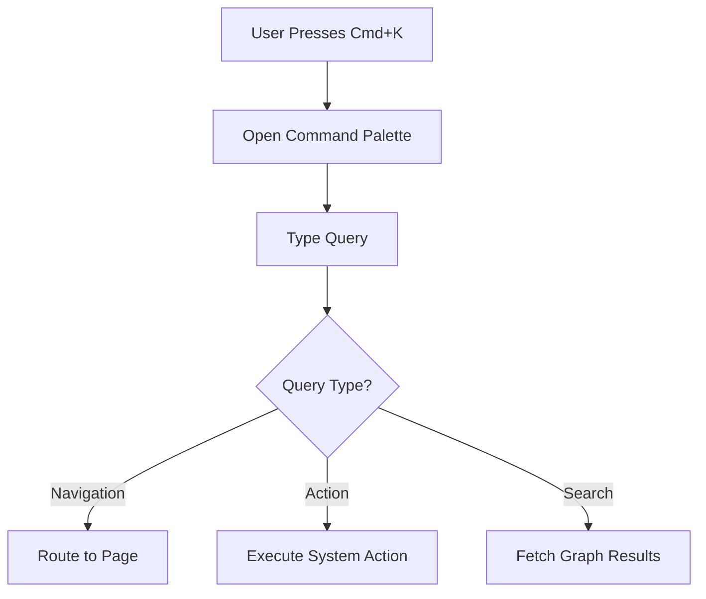

# Feature: Keyboard Shortcuts Panel (Command Palette)

## Overview
Power users navigate complex interfaces faster when they don't have to leave the keyboard. We've implemented Surya's fourteenth MVP feature: the **Command Palette**. This global interface brings all major PathFinder actions to the user's fingertips instantly.

## Capabilities Delivered
- **Global Key Listeners**: Integrated a robust, cross-platform `keydown` listener that handles both `Cmd` (Mac) and `Ctrl` (Windows/Linux) prefixes securely without disrupting native browser shortcuts.
- **The Palette UI (`Cmd+K`)**: Built `CommandPalette.tsx`, a gorgeous, glassmorphic modal interface mimicking the sleek feel of modern code editors (like VS Code or Raycast).
- **Direct Action Binding**:
  - `Cmd/Ctrl + I`: Instantly opens the IDE sidecar for the currently active learning node.
  - `Cmd/Ctrl + H`: Instantly summons the AI Coach for help on the current milestone.
  - `Cmd/Ctrl + O`: Instantly toggles the Offline Mode simulation.
  - `Escape`: Instantly dismisses the palette.
- **Context Awareness**: The keyboard commands seamlessly read from the `usePathStore.ts` global state, ensuring they act exactly on the user's current context.

## Quality Assurance
- **Optimized Commit Strategy**: Grouped the store logic, the new command palette UI, and the page integration into a single feature commit (`feat(shortcuts): implement command palette and global keyboard shortcuts`).
- **Pristine Environment**: Zero test or benchmark files lingered in the workspace (Rule 7).

PathFinder can now be piloted entirely from the keyboard!

## Flow Diagram

Or in text form:
1. User triggers the command palette via keyboard shortcut.
2. User types a query.
3. System parses the query to determine if it is navigation, an action, or a search.
4. The system executes the corresponding logic securely and instantly.
