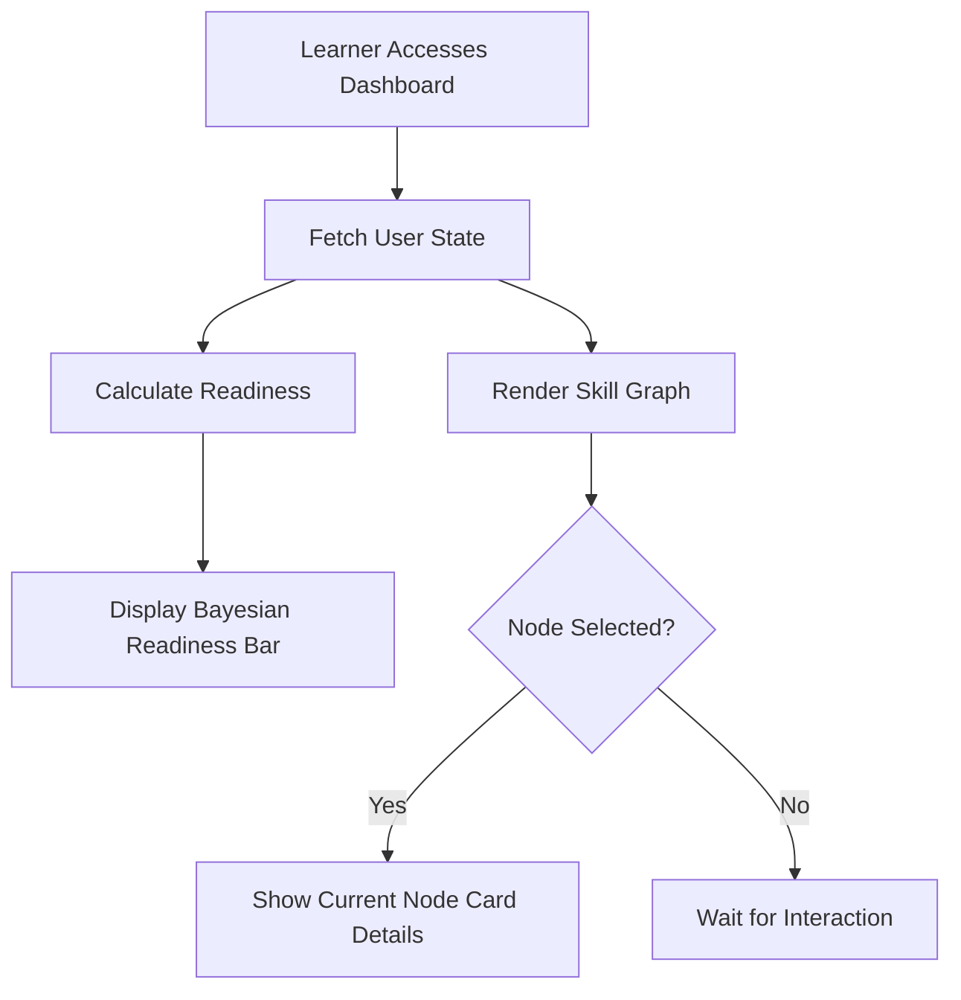

# Learner Dashboard and Pathing

## Overview
The Learner Dashboard provides the primary user interface for the AVEN platform. It integrates a dynamic, interactive skill graph with real-time Bayesian Knowledge Tracing (BKT) metrics, offering learners a stunning, high-contrast visualization of their progression and upcoming milestones.

## Architecture
The frontend leverages React Flow for high-performance canvas rendering and Zustand for reactive state management. The UI strictly adheres to a minimalist, high-contrast design system optimized for cognitive focus.

## Flow Diagram

Or in text form:
1. The learner accesses the dashboard.
2. The application fetches the user's current progress and graph state.
3. The interactive skill graph is rendered alongside the Bayesian Readiness metric.
4. If the learner selects a specific node, detailed context and rationale ("Why-This-Step") are displayed in the Current Node Card.

## Key Components
- **`ReadinessBar.tsx`**: Enterprise-grade visualization component that dynamically reflects the learner's posterior mastery probabilities using high-contrast gradients.
- **`CurrentNodeCard.tsx`**: Presents active milestones with clear, actionable context to maintain learner focus.
- **`AutonomySliders.tsx`**: Grants the learner precise control over their learning path pacing and difficulty.

## Data and Configuration
Relies on real-time graph data from the BKT engine. The state is centrally managed via Zustand (`usePathStore`) to ensure zero-latency UI updates during adaptive replanning.

## Integration Points
- **Adaptive Engine**: Directly integrated with the backend adaptive loop, ensuring the graph accurately reflects the learner's true knowledge state.
- **Assessment Subsystem**: Tightly coupled with the Prove-It gates; successfully bypassing a node triggers an instant visual update in the dashboard graph.

## Usage Notes
The dashboard is the default route for users authenticated as `LEARNER`. It requires a modern browser capable of hardware-accelerated canvas rendering for the skill graph.
