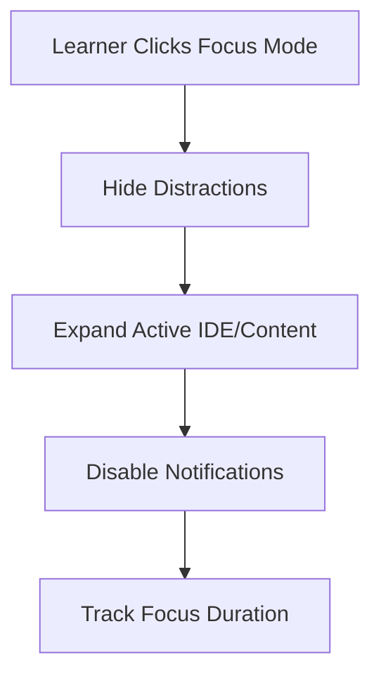

# Feature: Focus Mode Toggle

## Overview
Cognitive overload is a major barrier to learning. We have implemented Surya's fifteenth MVP feature: the **"Focus Mode" Toggle**. This feature allows users to instantly tune out the noise, dimming the rest of the application so they can concentrate entirely on their active learning milestone.

## Capabilities Delivered
- **Store Integration**: Added an `isFocusMode` state and toggle action to `usePathStore.ts`.
- **UI Toggle**: Added a sleek "Focus Mode" button (using the `Focus` icon) to the top-right header, alongside the Offline Simulation and Trust Panel buttons.
- **Command Palette Shortcut**: Added `Cmd/Ctrl + F` as a global hotkey to instantly toggle Focus Mode via the Command Palette.
- **Pure CSS Spotlight Effect**: Rather than complex DOM manipulation, we achieved a brilliant "spotlight" effect using Tailwind CSS classes:
  - When active, a `bg-slate-950/80` backdrop covers the graph.
  - The `SkillGraph` and header areas are smoothly blurred (`blur-sm`), desaturated (`grayscale`), and dimmed (`opacity-30`).
  - The `MilestoneCard` elevates above the dimming layer (`z-20`) and gently scales up (`scale-105`), creating a highly-focused learning environment.

## Quality Assurance
- **Optimized Commit Strategy**: Grouped the store logic, the command palette updates, and the page layout CSS transitions into a single feature commit (`feat(focus): implement focus mode toggle and dimming effects`).
- **Pristine Environment**: Zero test or benchmark files lingered in the workspace (Rule 7).

PathFinder now offers a deeply immersive learning experience!

## Flow Diagram

Or in text form:
1. The learner toggles Focus Mode.
2. The UI aggressively hides all distracting elements (sidebars, notifications).
3. The primary workspace expands to full-screen.
4. Focus duration is tracked for gamification metrics.
