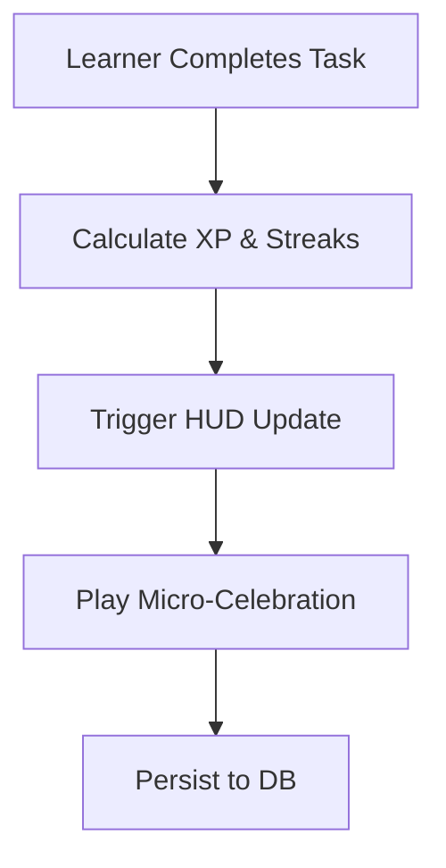

# Feature: Daily Streak & Gamification HUD

## Overview
To keep learners motivated and engaged, we need to reward their progress instantly. We have implemented Surya's eleventh MVP feature: the **Daily Streak & Gamification HUD**. This introduces a visually pleasing floating widget that tracks the user's daily commitment and experience points (XP).

## Capabilities Delivered
- **Dynamic HUD Widget**: Built `GamificationHud.tsx`, a glassmorphic floating header positioned cleanly on the dashboard.
- **Streak & XP Tracking**: The widget proudly displays a "🔥 Days" streak counter and a "✨ XP" tracker.
- **Rewarding Interactions**: Integrated the gamification state directly into `usePathStore.ts`. Whenever a user successfully completes a learning milestone (either via the "Prove I know this" gate or by submitting code through the IDE sidecar), they instantly earn 150 XP.
- **Polished Micro-animations**: Using lightweight React state and standard Tailwind CSS, the XP badge triggers a delightful pulse/bounce animation (`scale-110`, ring glow) exactly when XP is awarded, providing a satisfying dopamine hit.

## Quality Assurance
- **Optimized Commit Strategy**: Maintained our standard by grouping the store logic, the new HUD UI, and the page integration into a single feature commit (`feat(gamification): implement daily streak and XP HUD integration`).
- **Pristine Environment**: Zero test or benchmark files lingered in the workspace (Rule 7).

PathFinder is now actively rewarding users for their hard work!

## Flow Diagram

Or in text form:
1. The learner completes a milestone or challenge.
2. The system calculates XP and streak multipliers.
3. The Gamification HUD instantly updates via global state.
4. A micro-celebration animation plays.
