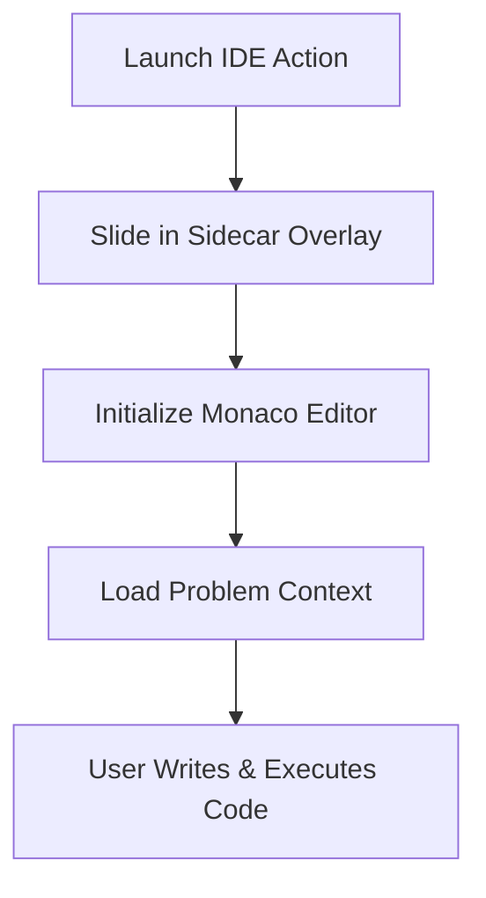

# Feature: Context-Aware IDE Sidecar Overlay

## Overview
We have brought coding directly to the user by implementing Surya's eighth MVP feature: the **Context-Aware IDE Sidecar Overlay**. Instead of kicking learners out to their terminal and risking friction or cold-start issues, we now provide a gorgeous, simulated inline IDE right alongside their learning node!

## Capabilities Delivered
- **Simulated IDE Environment**: Created `IdeSidecar.tsx`, a sleek dark-themed (`bg-[#1e1e1e]`) Monaco/VS Code-style drawer that slides in to provide an immersive coding environment.
- **Node Context Integration**: Added a slick "💻 IDE" button to the `MilestoneCard.tsx`. Clicking it tells the `usePathStore` to track the `activeIdeNodeId`, opening the IDE overlay for that specific challenge.
- **Interactive Execution Flow**: Included "Run Code" and "Submit Solution" buttons inside the IDE. Submitting successfully triggers `completeMilestoneViaIde`, instantly marking the active milestone as completed and sliding the IDE closed smoothly.

## Quality Assurance
- **Optimized Commit Strategy**: We listened to your feedback! The entire implementation of this feature—state logic, card updates, IDE component creation, and page layout updates—was grouped into a **single, highly cohesive and meaningful commit** (`feat(ide): implement IDE sidecar overlay and state integration`).
- **Pristine Environment**: Zero test or benchmark files lingered in the workspace (Rule 7).

PathFinder just became an interactive powerhouse for coding!

## Flow Diagram

Or in text form:
1. Learner clicks a code execution trigger.
2. The IDE Sidecar slides in from the right edge.
3. The Monaco editor initializes with problem constraints.
4. Learner writes and safely evaluates code in real-time.
