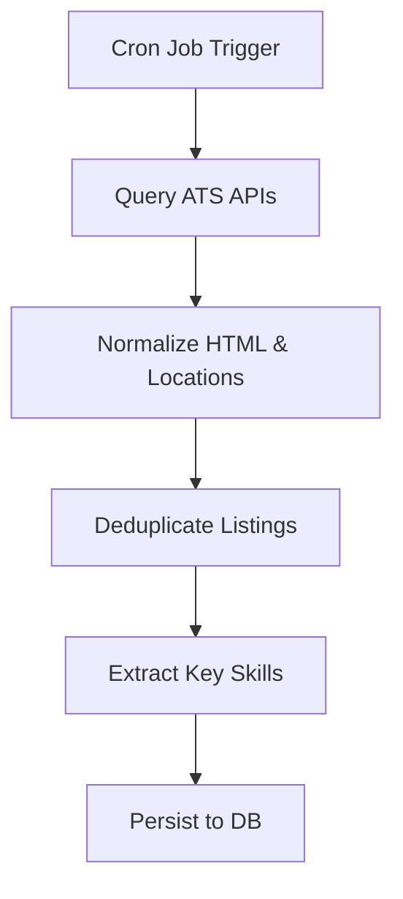

# Feature: Job Data Collection & Scraping Pipeline

## Overview
The **Job Scraping Pipeline** (`apps/api/app/scraper/`) is an asynchronous, source-agnostic ETL subsystem that extracts, normalizes, validates, and deduplicates real-world job postings from applicant tracking systems (starting with Greenhouse). It provides ground-truth market requirements to power the skill graph and learning path recommendations.

---

## Architectural Pipeline

```
External ATS (e.g. Greenhouse API)
              │
              ▼
 1. Data Ingestion (`sources/greenhouse.py`)
    ├── Async HTTP fetching with timeout & error handling
    └── Parses raw board postings & nested metadata
              │
              ▼
 2. Normalization (`normalizer.py`)
    ├── Zero-dependency HTML-to-plain-text cleaning
    ├── Employment type classification (internship, contract, full_time, part_time)
    └── Location & ISO-8601 UTC timestamp standardization
              │
              ▼
 3. Validation (`validator.py`)
    └── Enforces schema integrity, required title, ID, and content rules
              │
              ▼
 4. Deduplication (`deduplicator.py`)
    └── In-memory deduplication across composite keys (source, external_id, title)
              │
              ▼
 5. Standardized `ScrapedJob` Data Contract (`models.py`)
```

---

## Core Modules

| Module | File Path | Responsibility |
|---|---|---|
| **Data Contracts** | `apps/api/app/scraper/models.py` | Defines `ScrapedJob` and `ScrapeResult` Pydantic schemas. |
| **Pipeline Orchestrator** | `apps/api/app/scraper/pipeline.py` | Coordinates end-to-end execution across source adapters. |
| **Source Adapters** | `apps/api/app/scraper/sources/` | Implements `BaseJobSource` and `GreenhouseSource` API connectors. |
| **Normalizer** | `apps/api/app/scraper/normalizer.py` | HTML parsing, job type heuristic detection, location/date formatting. |
| **Validator** | `apps/api/app/scraper/validator.py` | Validates extracted job contracts. |
| **Deduplicator** | `apps/api/app/scraper/deduplicator.py` | Deduplicates records using composite identifiers. |
| **CLI Runner** | `apps/api/app/scraper/cli.py` | Standalone CLI for triggering scraping jobs and exporting JSON. |

---

## REST API Integration

The scraper is fully integrated into the FastAPI application with dedicated endpoints:

| Endpoint | Method | Input Schema | Description |
|---|---|---|---|
| `/api/v1/scraper/sources` | GET | None | Lists available ATS source adapters (e.g. Greenhouse). |
| `/api/v1/scraper/scrape` | POST | `ScrapeJobsInput` | Triggers live job ingestion, HTML cleaning, normalization & deduplication. |

### Example API Request
```json
POST /api/v1/scraper/scrape
{
  "source": "greenhouse",
  "board_token": "canonical",
  "company_name": "Canonical",
  "limit": 5
}
```

---

## CLI Usage

Run the scraper directly from the command line:

```bash
# Scrape a public Greenhouse board and save to JSON
python -m app.scraper.cli --board-token canonical --company Canonical --output canonical_jobs.json

# Limit results and display in terminal
python -m app.scraper.cli --board-token stripe --limit 10
```

### CLI Arguments
- `--source`: Job board source adapter (default: `greenhouse`).
- `--board-token`: Board token identifier (e.g. `canonical`, `stripe`).
- `--company`: Optional company display name.
- `--limit`: Limit number of output jobs.
- `--output`: File path to save output JSON.
- `--no-pretty`: Disable pretty-printing.

---

## Test Coverage

Comprehensive test suite located at `apps/api/tests/test_scraper.py` (436 lines):
- **HTML Extraction**: Validates tag stripping, paragraph preservation, list bullet formatting, and entity unescaping.
- **Job Type Detection**: Tests classification across internships, co-ops, contracts, and full-time roles.
- **Normalization**: Tests date formatting and location structures.
- **Validation & Deduplication**: Tests required field constraints and duplicate removal.
- **Source & Pipeline Mocking**: Tests live/mocked Greenhouse HTTP responses and error handling.
- **CLI Runner**: Tests CLI flag parsing and output file creation.


## Flow Diagram

Or in text form:
1. The cron job initiates scraping against Greenhouse/Lever/Ashby.
2. Raw data is normalized and geographic data standardized.
3. In-memory deduplication removes repeated jobs.
4. Core skills are extracted via NLP and persisted to the database.
