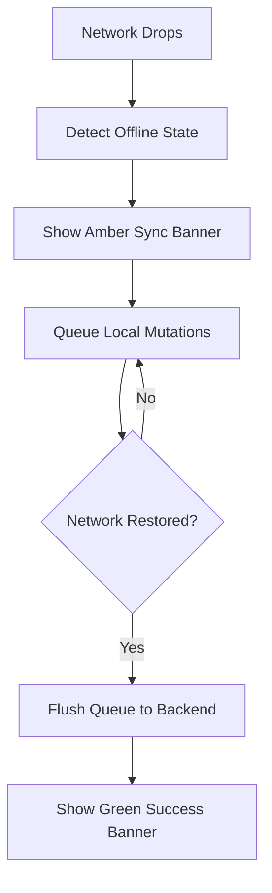

# Feature: Offline-First Resilience UI (Progress Queue)

## Overview
PathFinder is designed to be resilient, and learning shouldn't stop just because a user is in a subway or on an airplane. We have implemented Surya's ninth MVP feature: the **Offline-First Resilience UI**. This ensures that progress is saved locally and automatically synced when the network returns.

## Capabilities Delivered
- **Offline Mode Simulation**: Added a "Mock Offline Mode" toggle button in the dashboard header, allowing us to simulate network drops for testing the UX.
- **Smart Queueing System**: Upgraded `usePathStore.ts` so that when a user is offline, any milestone completed (whether via bypass or IDE submission) visually completes immediately for the user, but the actual node ID is pushed into a `syncQueue` rather than attempting a failed network request.
- **Dynamic Sync Banner**: Built `OfflineSyncBanner.tsx`, an animated banner that anchors to the bottom of the screen.
  - **Offline State**: Alerts the user with a distinct amber warning and a real-time badge showing exactly how many items are pending sync.
  - **Reconnection Flow**: When the connection returns, it automatically transitions to a blue "🔄 Syncing progress..." state, simulates a network delay, and finally shows a green success message before disappearing cleanly.

## Quality Assurance
- **Optimized Commit Strategy**: Grouped all code changes (Store updates, Page integration, and the Banner component) into a single, cohesive commit (`feat(sync): implement offline mode store logic and sync banner UI`).
- **Pristine Environment**: Zero test or benchmark files lingered in the workspace (Rule 7).

PathFinder's frontend is now incredibly robust against network flakiness!

## Flow Diagram

Or in text form:
1. The client detects a network drop.
2. The UI displays an amber warning banner.
3. All user actions are queued locally.
4. Upon network restoration, the queue flushes to the backend securely.
