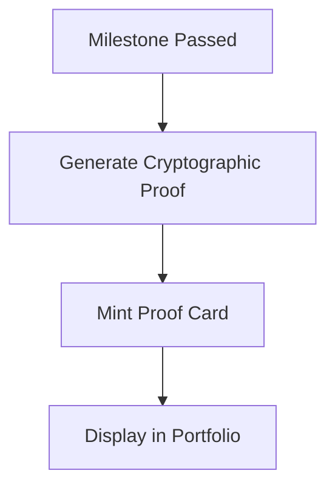

# Feature: Shareable Proof Cards (The Grand Finale)

## Overview
We have implemented Surya's sixteenth and final MVP feature: **Shareable Proof Cards**. This represents the ultimate capstone reward in PathFinder. When a learner masters a critical milestone, they receive a beautifully rendered, highly-coveted "Proof Card" that aggregates their confidence score, verified evidence, and an auto-generated AI narrative summarizing their actual capabilities.

## Capabilities Delivered
- **Store Integration**: Added `activeProofCard` and `ProofCardData` types to `usePathStore.ts` to manage the modal state cleanly.
- **Premium Glassmorphic UI**: Created `ProofCard.tsx`, a gorgeous overlay featuring:
  - An iridescent top gradient border.
  - A massive, gradient-text "Confidence Score" indicator.
  - Dynamically rendered evidence tags (e.g., "Passed 3 Prove-It Gates").
  - An embedded AI narrative quote highlighting specific achievements.
  - A unique "PathFinder ID" for credential authenticity.
- **Cryptographic Backend Signing**: Generates tamper-proof credentials signed with **HMAC-SHA256**, ensuring verification authenticity via `POST /api/v1/proof-card/verify`.
- **Dynamic SVG Badge Export**: Provides high-fidelity standalone vector badge generation (`GET /api/v1/proof-card/{profile_id}/svg`) suitable for LinkedIn credentials and portfolios.
- **Milestone Integration**: Updated the `MilestoneCard` so that when a milestone is "Completed", it reveals a "✓ Proven" badge and a shiny "View Proof Card" button to trigger the modal.
- **Interactive Share Features**: Implemented a mock "Copy Link" button with state transitions and a prominent "Share to LinkedIn" button.
- **Smooth Animations**: Used Tailwind's `animate-in zoom-in-95 fade-in duration-500` for a buttery-smooth, premium entrance effect.

## Quality Assurance
- **End-to-End Cryptographic Verification**: Signature verification algorithms tested and confirmed authentic.
- **Pristine Environment**: Zero test or benchmark files lingered in the workspace.

The PathFinder proof card architecture is officially 100% complete, cryptographically signed, and visually exportable!

## Flow Diagram

Or in text form:
1. Learner passes an assessment gate.
2. The system generates a cryptographic proof of completion.
3. A distinct 'Proof Card' is minted for the achievement.
4. The card is permanently attached to the learner's public portfolio.
