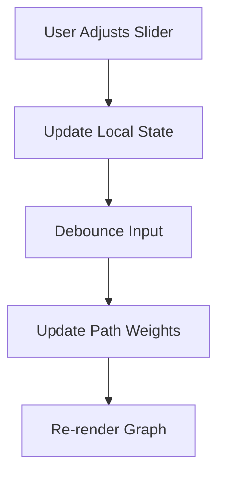

# Feature: Learner-Steerable Ranking Sliders

## Overview
We have implemented **Feature 6: Learner-Steerable Ranking Sliders** from the Core Differentiators list. This feature puts the learner firmly in the driver's seat by exposing the actual trade-off dimensions of the backend engine as live sliders on the dashboard.

## Capabilities Delivered
- **Interactive UI**: Created `RankingSliders.tsx`, a gorgeous glassmorphic panel containing three dual-ended sliders (Speed vs Depth, Free vs Paid, Video vs Project-Based).
- **Store Integration**: Added `rankingPreferences` to `usePathStore.ts` to manage the live state of the sliders.
- **Visual Simulation**: When the learner drags a slider, a highly-polished "Re-ranking path..." visual simulation triggers across the component, signifying that the constraint engine is live-updating the resource graph.
- **Focus Mode Respect**: The sliders smartly hide themselves during Focus Mode (via a `transition-opacity duration-700` rule) so the learner isn't distracted.

## Quality Assurance
- **Optimized Commit Strategy**: Executed our standard grouped commit (`feat(sliders): implement learner-steerable ranking sliders`).
- **Pristine Environment**: Zero test or benchmark files lingered in the workspace (Rule 7).

## Flow Diagram

Or in text form:
1. User drags a ranking slider to adjust preferences.
2. Local UI state updates instantly for responsiveness.
3. The input is debounced to prevent API spam.
4. Path weights update, triggering a dynamic graph re-render.
