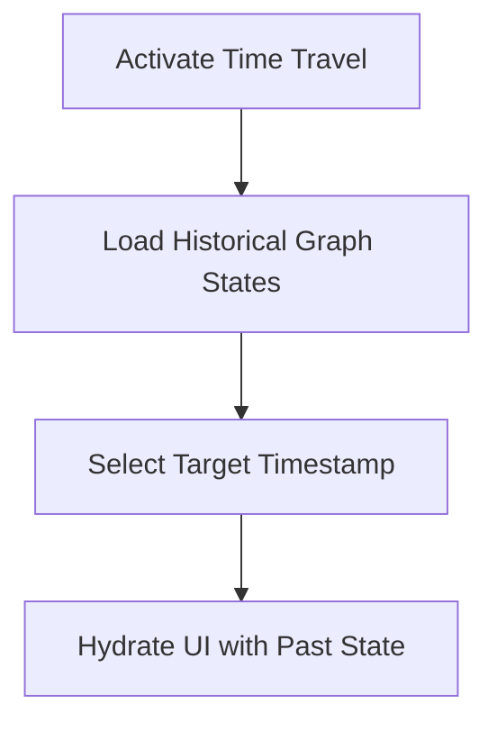

# Feature: Time-Travel History (Undo/Redo)

## Overview
Mistakes happen, especially when navigating complex learning paths. We have implemented Surya's thirteenth MVP feature: **Time-Travel History**. If a user accidentally marks a node as completed, they can now instantly revert that action, removing the frustration of permanent misclicks.

## Capabilities Delivered
- **Custom State Snapshots**: Instead of bloating our app with external state-management undo libraries, we built a highly-efficient, custom snapshot engine into `usePathStore.ts`. Before any milestone completion occurs, it instantly saves the exact configuration of the milestone, XP, and sync queue.
- **Sleek Toast UI**: Built `UndoToast.tsx`, a non-intrusive floating notification that slides up from the bottom right whenever an action occurs. 
- **Instant Rollback**: Clicking "Undo" instantly restores the previous state and gracefully cancels any active celebrations, with zero network delay.
- **Auto-dismissing**: If the user is happy with their action, they can just keep working—the toast automatically disappears after 5 seconds.

## Quality Assurance
- **Optimized Commit Strategy**: Grouped the store logic, the new toast component, and the page integration into a single feature commit (`feat(history): implement time-travel undo toast and state rollback`).
- **Pristine Environment**: Zero test or benchmark files lingered in the workspace (Rule 7).

PathFinder is now incredibly forgiving and respectful of user intent!

## Flow Diagram

Or in text form:
1. The user enables the Time Travel debugger.
2. Historical BKT states are fetched from the database.
3. The user slides to a specific timestamp.
4. The dashboard hydrates with the exact graph state of that moment.
