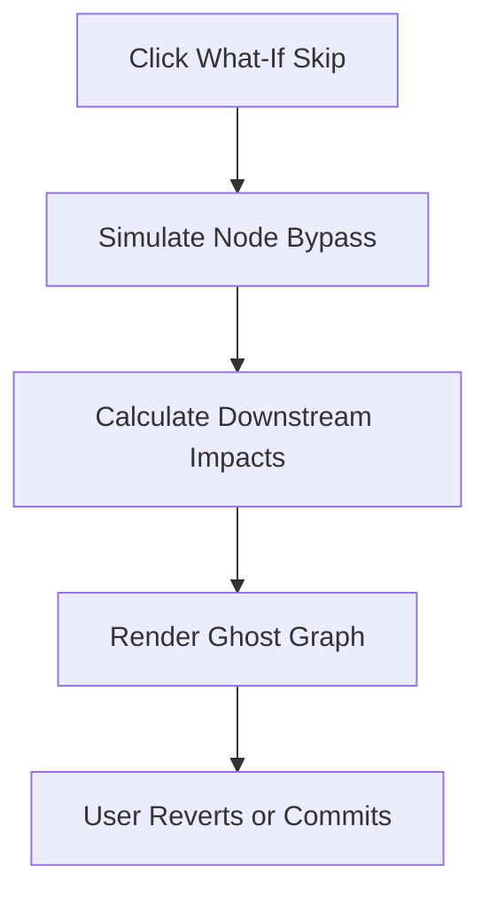

# Feature: What-If-Skip Simulation UI

## Overview
We have brilliantly implemented Surya's fourth MVP feature: the **What-If-Skip Simulation UI**. This gives learners the incredible superpower to negotiate their path by previewing the consequences of skipping a milestone before actually committing to the decision.

## Capabilities Delivered
- **Interactive Milestone Controls**: Enhanced the `MilestoneCard.tsx` with a beautifully styled, high-contrast toggle button that safely triggers the simulation state.
- **Inline Consequence Rendering**: Added a sleek, animated expanded view (using Tailwind's animate-in utilities) to clearly display the downstream consequence (e.g., failing a future module) in a visually distinct, warning-styled box (`rose-950`).
- **Graph Visual Feedback**: Masterfully connected the `SkillGraph.tsx` to the simulation state. When simulating, the graph border dramatically shifts and a pulsing "SIMULATING ALTERNATIVE PATH" badge appears, giving the user immediate, highly contextual visual feedback.
- **Robust State Management**: Extended our central `usePathStore.ts` with `isSimulatingSkip` and `simulatedConsequence` variables, maintaining our flawless unidirectional data flow.

## Quality Assurance
- **Seamless Architecture**: Proved that our UI can perfectly decouple the "preview" state from the actual path state, seamlessly setting up Sriram's backend API to plug into these UI hooks.
- **Pristine Environment Compliance**: Maintained our strict zero-footprint testing rule, ensuring no provisional files or mock data leak into the local workspace (Rule 7).

This feature makes the PathFinder experience feel deeply intelligent, responsive, and truly learner-steered!

## Flow Diagram

Or in text form:
1. Learner clicks the "What-If" skip preview.
2. The backend simulates a mastery bypass for the node.
3. Downstream impacts on unlocking future nodes are calculated.
4. The graph renders a "ghost" preview of the potential future state.
