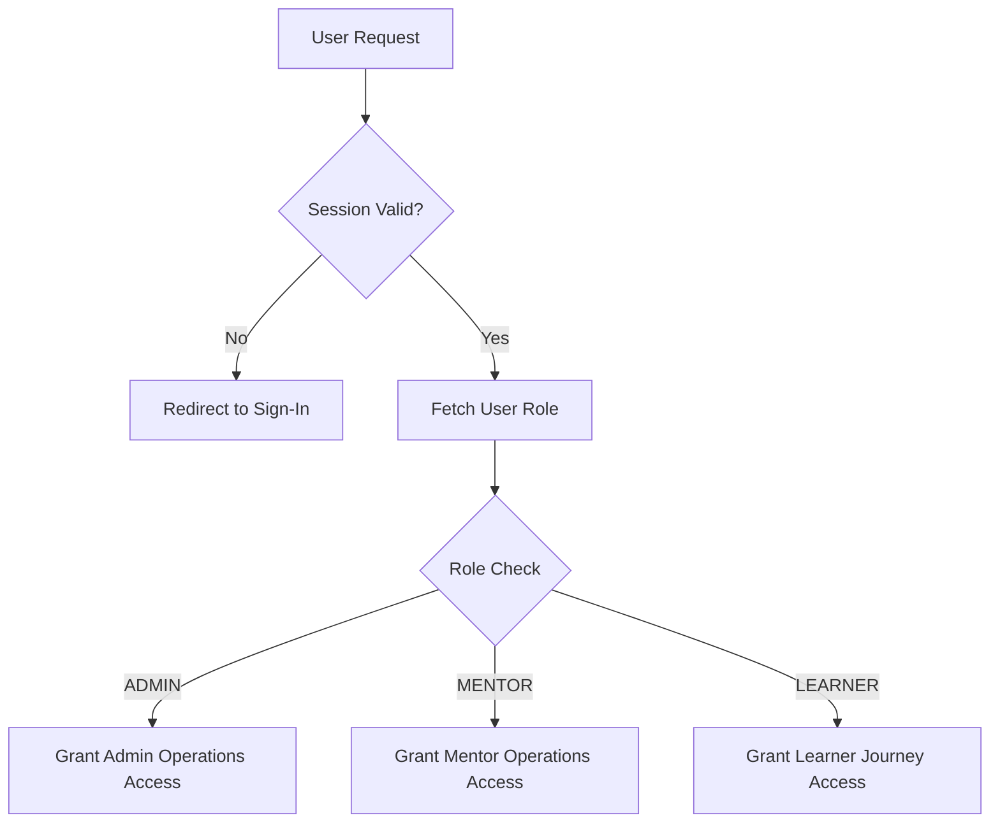

# Authentication and Authorization Flow

## Overview
The Authentication and Authorization subsystem provides a secure, enterprise-grade identity management and role-based access control (RBAC) layer for the AVEN platform. It seamlessly routes users to their dedicated dashboard experiences while strictly preventing privilege escalation or unauthorized state transitions.

## Architecture
This feature operates at the core routing level, wrapping the application component tree to intercept and validate session states securely before rendering views.

## Flow Diagram

Or in text form:
1. A user attempts to access an application route.
2. The system checks if an active, valid session exists. If not, the user is redirected to the sign-in flow.
3. If the session is valid, the system retrieves the authenticated user's Role-Based Access Control (RBAC) identity.
4. The authorization layer evaluates the role and routes the user strictly to their designated operational dashboard (Admin, Mentor, or Learner), preventing cross-role access.

## Key Components
- **`RoleGuard.tsx`**: The robust front-end authorization interceptor. Enforces RBAC boundaries and ensures user pathways align with their system roles.
- **`clerkSafe.tsx`**: A secure wrapper for identity state retrieval that ensures robust handling of potentially missing or malformed identity payloads.
- **`sign-in/page.tsx` & `sign-up/page.tsx`**: Clean, modular entry points for the secure user authentication flows.

## Data and Configuration
The authentication layer relies on secure identity provider configuration via environment variables (e.g., identity keys) and internal RBAC assignments (`role: 'ADMIN' | 'MENTOR' | 'LEARNER'`).

## Integration Points
- **Client Router Integration**: Integrates directly with Next.js navigation primitives to control client-side transitions.
- **Onboarding Subsystem**: Mentors and Admins bypass initial diagnostic flows seamlessly due to `RoleGuard` logic integration with the Pathfinder store.

## Usage Notes
This feature runs transparently on every protected route transition. No manual invocation is required from standard business logic components, as it is applied at the layout level.
